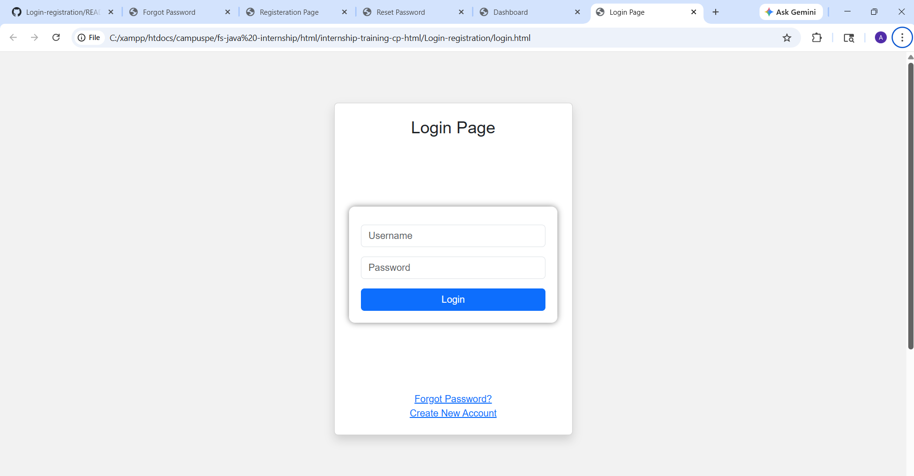
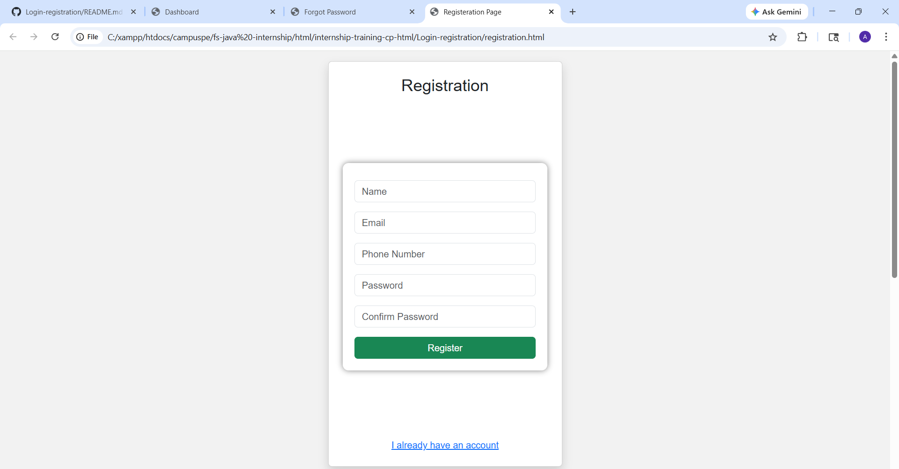
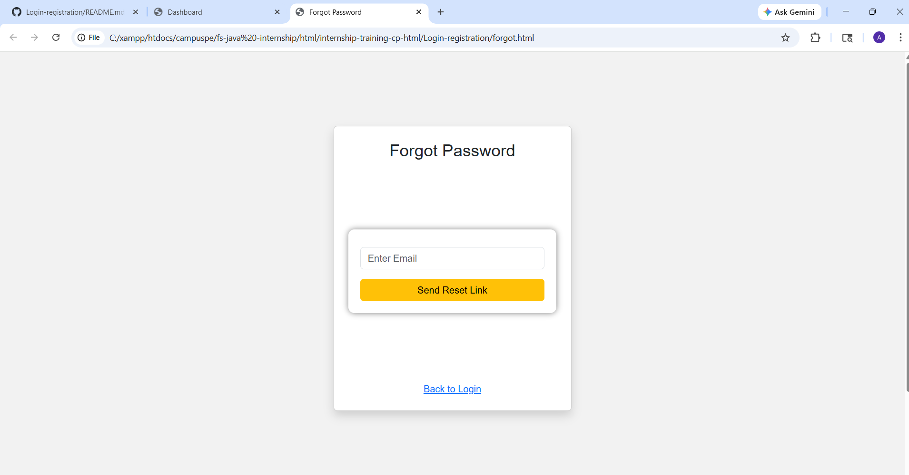
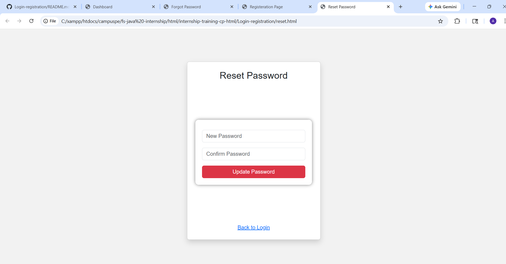
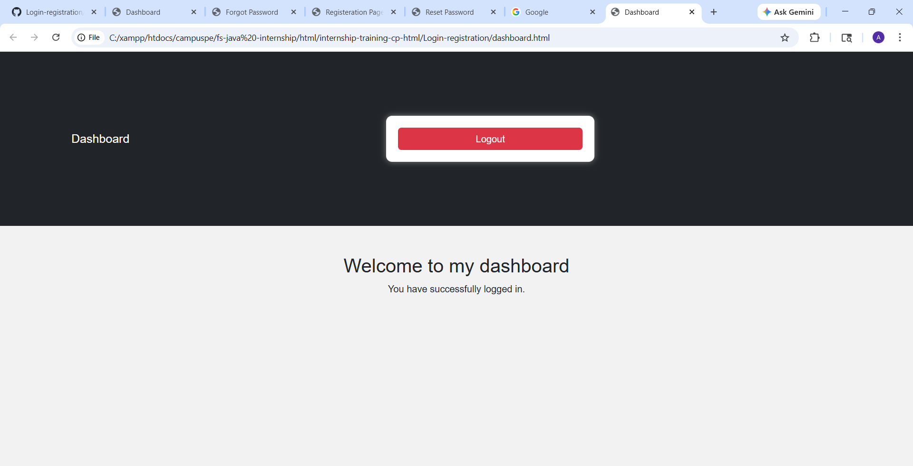

This login registration page is to helps to understand how to redirect to an another page by using an "href".This project is a simple Login and Registration System developed using HTML. The main purpose of this project is to create different pages for user authentication such as login, registration, dashboard, forgot password, and reset password.
The login page allows users to enter their username and password and redirects them to the dashboard page. The registration page allows new users to create an account by entering their details. The forgot password page helps users to reset their password, and the reset page allows them to create a new password.
This project contains five files, which are login.html, registration.html, dashboard.html, forgot.html, and reset.html. Each file performs a specific function in the system. The main features of this project include user login, new user registration, forgot password option, reset password functionality, and dashboard display.

## Screenshots

### Login Page

### Registration Page

### Forgot Password Page

### Reset Password Page

### Dashboard Page
